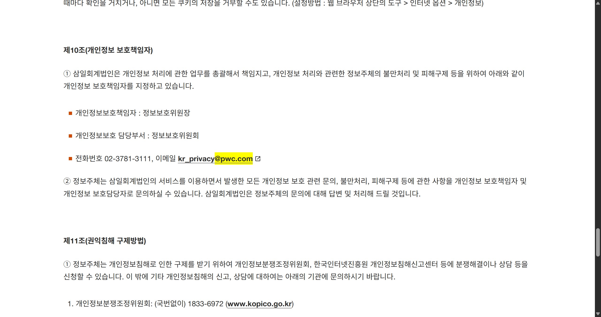

# 이메일 도메인 크롤러 (Email Domain Crawler)

사용자가 입력한 공식 웹사이트를 재귀적으로 탐색하여 식별대상 이메일도메인이 포함된 페이지를 찾아내고,  
발견 시 Selenium으로 해당 위치를 하이라이팅하고 스크린샷까지 저장하는 Python GUI 프로그램입니다.

---

## 주요 기능

- 공식 웹사이트 내부 링크를 따라가며 이메일 도메인 포함 여부 크롤링
- 내부링크 탐색 우선순위 설정 : 개인정보처리방침-이용약관-고객센터-공지사항-채용-기타 순으로 순차 탐색
- `mailto:` 링크까지 검사하여 이메일 도메인 존재 여부 확인,
  mailto 링크만 별도로 관리, 타 링크에서 도메인 미검색 시 mailto 링크에서 최종 검색
- 식별 대상 도메인과 공식웹사이트에 기재된 도메인이 다를 경우를 대비하여 웹사이트 내 모든 도메인 추출  
- 이메일 도메인 텍스트를 페이지에서 노란색 하이라이트 처리 (Selenium 사용)
- 하이라이트된 페이지 스크린샷 자동 저장
- GUI 제공 (CustomTkinter 기반)
- 검색된 모든 이메일 도메인과 해당 URL 실시간으로 출력

---

## 사용 기술

- Python 3.x
- requests
- beautifulsoup4
- selenium
- webdriver-manager
- customtkinter
- re, threading, time (표준 라이브러리)

---

## 설치 방법

1. Python 3.x 설치 ([공식 사이트](https://www.python.org/downloads/))

2. 의존 패키지 설치 (터미널 또는 CMD에서 프로젝트 폴더로 이동 후):

    ```bash
    pip install -r requirements.txt
    ```

---

## 사용 방법

1. 프로그램 실행 (`main.py` 실행)

2. 공식 웹사이트 URL 입력 (예: `https://www.example.com`)

3. 이메일도메인 입력 (예: `@example.com`)

4. '확인' 버튼 클릭

5. 크롤링 진행 및 결과 확인  
   - 도메인 포함 페이지 발견 시 Selenium이 페이지를 열어 하이라이트하고 캡처  
   - mailto 링크에서 도메인 찾으면 별도 안내 - url만 출력, 캡처 불가  
   - 찾지 못하면 실패 메시지 출력

6. 검색된 모든 이메일 도메인과 URL은 하단 텍스트 박스에서 실시간 확인 가능

---

## 파일 구성

        email-domain-crawler/
        │
        ├── main.py # 메인 실행 코드
        ├── README.md # 당해 설명서
        └── requirements.txt # 필요한 패키지 목록
        
---

## 실행 화면 예시




---

## 앞으로 개선할 점 (TODO)

1. 동적 페이지 및 탭 이동 지원 강화

현재는 단일 정적 페이지 위주로 하이라이트 및 캡처가 가능하며, 탭 이동이나 자바스크립트로 동적으로 구성된 페이지에서는 도메인 탐색과 캡처가 제한적입니다.
해결 방안: Selenium, Playwright 등의 브라우저 자동화 도구 활용법을 학습하여, 탭 전환과 JavaScript 렌더링 콘텐츠 탐색 기능을 확장할 예정입니다. 이를 통해 다양한 동적 웹 환경에서도 정확한 도메인 검색과 캡처가 가능하도록 개선하겠습니다.

2. 공유 폴더에 캡처본 저장 및 재사용 기능 추가

캡처 이미지를 로컬 대신 네트워크 공유 폴더에 저장하고, 프로그램 실행 시 해당 폴더를 먼저 탐색하여 중복 캡처를 방지하는 기능을 도입할 계획입니다.
향후 Python의 os 라이브러리 및 파일 입출력 관련 모듈들을 활용하여, 경로 관리와 파일 중복 검사, 자동 정리 기능 등을 구현하며 관련 역량을 지속적으로 학습할 예정입니다.

3. 세부 기능 개선 사항

✅ **크롤링 도중 중단할 수 있는 [중단] 버튼 추가**  
현재는 진행 중 강제 종료가 불가능하여, 크롤링이 길어지는 경우에는 불편함이 있습니다. 별도의 중단 버튼을 만들거나 기존의 종료버튼에 중단 기능을 추가하여 사용자가 크롤링을 조기 종료할 수 있도록 개선할 계획입니다.

✅ **`mailto:` 링크에서 도메인 검색 시 Outlook 자동 실행 및 캡처 기능 추가**  
현재는 `mailto` 링크에서 도메인을 발견해도 ulr 주소만 추출할 뿐 캡처는 불가합니다. 사용자의 로컬 Outlook을 자동 실행하고, Outlook 수신인 란에 자동 기재되어있는 도메인 캡처 기능 추가를 고려 중입니다.

4. 실제 현장 테스트 및 안정성 검증
 
향후 다양한 사이트를 대상으로 실전 테스트를 진행하여 안정성과 범용성을 확보하여야 합니다. 예를들면 일부 웹페이지는 하이라이트 대상이 iframe 내부에 위치해 있어, 검색은 가능하지만 화면 스크롤 및 캡처가 적용되지 않는 문제가 있습니다. 이를 해결하기 위해 HTML과 브라우저 자동화 도구에 대해 지속적으로 학습하며, 보다 정교하고 신뢰성 있는 크롤러 개발을 위해 노력할 계획입니다.


---

> 이 프로그램은 삼일회계법인 디지털 전형을 위해 개발된 개인 프로젝트입니다.  
> 작성자: 김지형  
> 최종 수정일: 2025-07-27
---

📦 GitHub Repository  
https://github.com/KimJIhyeong31/email-domain-crawler
